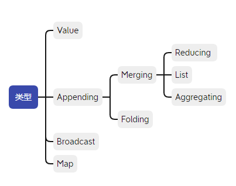
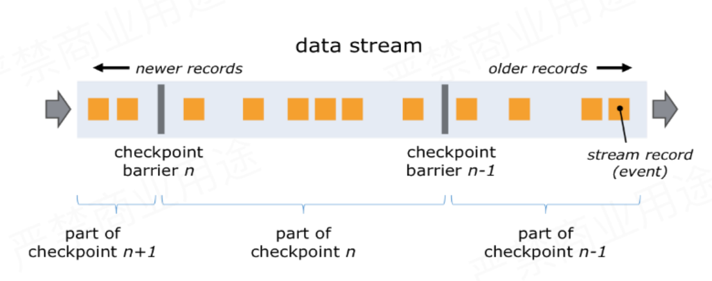
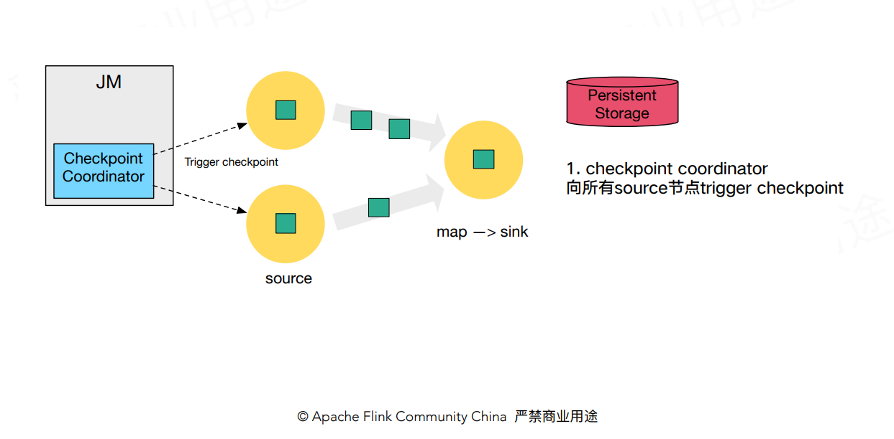
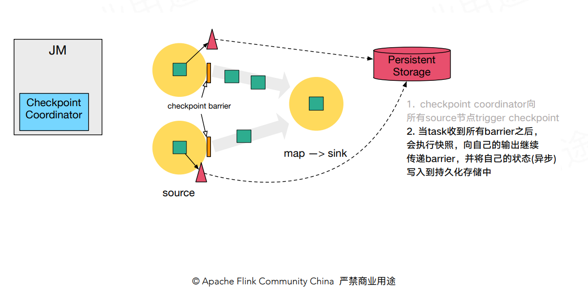
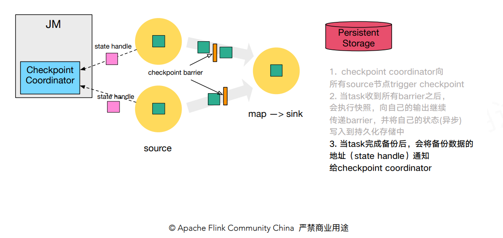
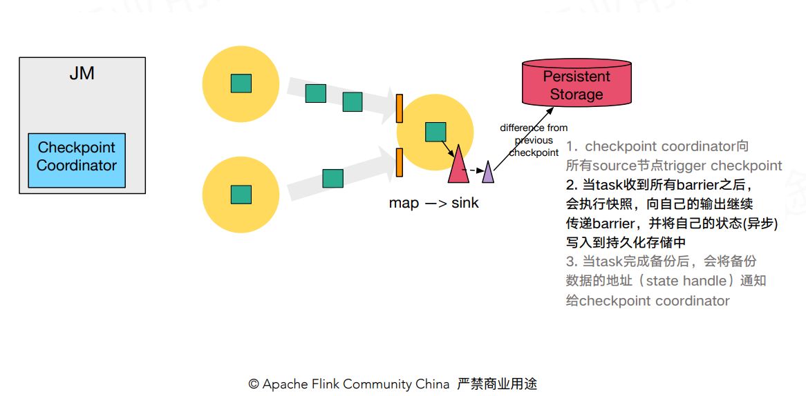
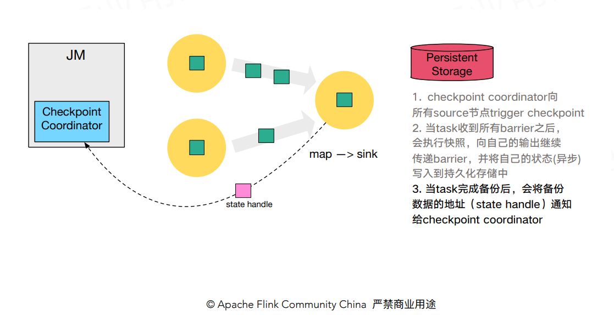
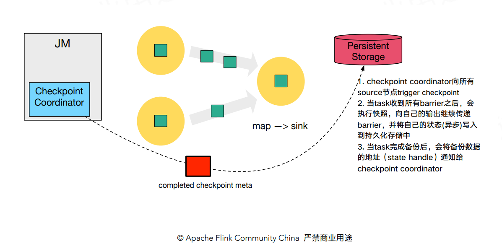
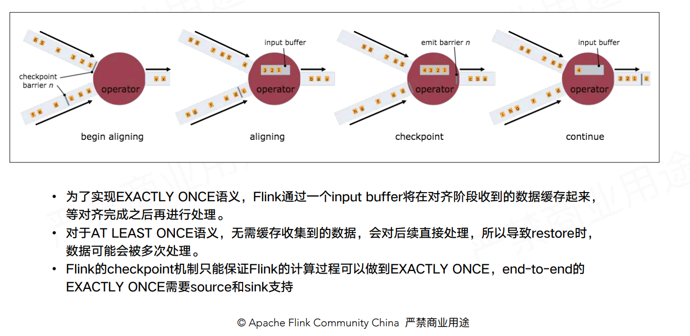

## Flink Job容错机制

Flink Job采用Checkpoint与State进行容错；

-   **Checkpoint**：在Flink中是一个执行操作，最终产生的结果作为分布式快照提供容错机制；
-   **State**：是Checkpoint的数据构成；

### State

#### 分类

是否由Flink管理：

-   Managed State：由Flink管理序列化的State；
-   Raw State：Flink仅提供Stream Api可以进行存储数据，需要用户维护序列化，即Flink只管理bytes；

是否有Key：

-   KeyedState：只能用在KeyedStream算子中，一个operator可处理多个key，对应多个state；
-   OperatorState：整个算子只对应一个state；

#### Backend

-   Memory：使用内存，默认；
-   FileSystem：一般使用HDFS；
-   RocksDB：一般生产环境使用；

### Checkpoint

Flink Checkpoint 与Spark一样采用 Chandy-Lamport 算法，会定时制作分布式快照，对程序中的状态进行备份；

简而言之，Flink的checkpoint是一个全局的、一致性的快照（snapshot）。其包含两方面：

- 数据源所有数据的位置；
- 并行操作的状态；

#### 执行流程

简单来说，包括以下几个部分：

-   JM trigger checkpoint；
-   Source 收到 trigger checkpoint 的 PRC，自己开始做 snapshot，并往下游发送 barrier；
    -   Task 开始同步阶段 snapshot；
    -   Task 开始异步阶段 snapshot；
-   下游接收 barrier，并作snapshot，直到Sink；
-   Task snapshot 完成，汇报给 JM；

第一步，Checkpoint Coordinator 向所有 source 节点 trigger Checkpoint；

第二步，source 节点向下游广播 barrier，这个 barrier 就是实现 Chandy-Lamport 分布式快照算法的核心，下游的 task 只有收到所有 input 的 barrier 才会执行相应的 Checkpoint。

第三步，当 task 完成 state 备份后，会将备份数据的地址（state handle）通知给 Checkpoint coordinator。

-   同步阶段：task执行状态快照，并写入外部存储系统（根据状态后端的选择不同有所区别）
     执行快照的过程：
    -   对state做深拷贝；
    -   将写操作封装在异步的FutureTask中；
-   异步阶段
    -   执行同步阶段创建的FutureTask；
    -   向Checkpoint Coordinator发送ACK响应；

 第四步，下游的 sink 节点收集齐上游两个 input 的 barrier 之后，会执行本地快照，这里特地展示了 RocksDB incremental Checkpoint 的流程，首先 RocksDB 会全量刷数据到磁盘上（红色大三角表示），然后 Flink 框架会从中选择没有上传的文件进行持久化备份（紫色小三角）。

同样的，sink 节点在完成自己的 Checkpoint 之后，会将 state handle 返回通知 Coordinator。

最后，当 Checkpoint coordinator 收集齐所有 task 的 state handle，就认为这一次的 Checkpoint 全局完成了，向持久化存储中再备份一个 Checkpoint meta 文件。

#### Checkpoint 的 EXACTLY_ONCE 语义

为了实现 EXACTLY ONCE 语义，Flink 通过一个 input buffer 将在对齐阶段收到的数据缓存起来，等对齐完成之后再进行处理。而对于 AT LEAST ONCE 语义，无需缓存收集到的数据，会对后续直接处理，所以导致 restore 时，数据可能会被多次处理。下图是官网文档里面就 Checkpoint align 的示意图：

##### End To End EXACTLY_ONCE

**Source**：需要支持数据重放，一般为Offset或Ack机制支持；

**Sink**：

1.   支持事务，通过2PC/3PC保证；
2.   支持幂等写入；

### Savepoint

>   用户通过命令触发，由用户管理其创建与删除

savepoint仅仅只是checkpoint的一个扩展。如果checkpoint开启，那Flink会周期性的创建所有操作状态的checkpoint。savepoint和checkpoint最大的不同是，checkpoint会按时间间隔自动创建，而savepoint需要手动触发。