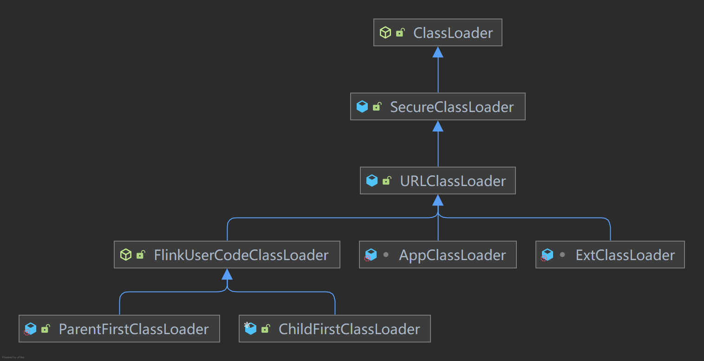

## Flink 类加载器

>   最近面试阿里云，被问到Flink的类加载器实现，由于目前公司采用的Application集群且将其当作Per-Job集群使用；Flink类加载相关问题一般使用Maven Shaded即可解决，未查看过其相关源码，遂查看源码并作总结；

Flink 社区对其类加载的分类：

-   **Java Classpath**：这是Java的通用类路径，它包括JDK库，以及Flink `/lib`文件夹中的所有代码（Apache Flink的类和一些依赖）；

-   **Flink Plugin Components**：插件代码在 Flink 的 `/plugins` 文件夹下的文件夹中。 Flink 的插件机制会在启动时动态加载一次；

-   动态用户代码（**Dynamic User Code**）：这些是动态提交的作业的 JAR 文件中包含的所有类（通过 REST、CLI、Web UI）， 它们按作业动态加载和卸载；

    >   session集群中，TM可能需要加载多个版本的jar；

### 默认参数

[Apache Flink Doc Configuration: Class Loading](https://nightlies.apache.org/flink/flink-docs-master/zh/docs/deployment/config/#class-loading)

| **Key**                                      | Default                                                      | Type         | Description                                                  |
| -------------------------------------------- | ------------------------------------------------------------ | ------------ | ------------------------------------------------------------ |
| classloader.check-leaked-classloader         | true                                                         | Boolean      | Fails attempts at loading classes if the user classloader of a job is used after it has terminated. This is usually caused by the classloader being leaked by lingering threads or misbehaving libraries, which may also result in the classloader being used by other jobs. This check should only be disabled if such a leak prevents further jobs from running. |
| classloader.fail-on-metaspace-oom-error      | true                                                         | Boolean      | Fail Flink JVM processes if 'OutOfMemoryError: Metaspace' is thrown while trying to load a user code class. |
| classloader.parent-first-patterns.additional |                                                              | List<String> | A (semicolon-separated) list of patterns that specifies which classes should always be resolved through the parent ClassLoader first. A pattern is a simple prefix that is checked against the fully qualified class name. These patterns are appended to "classloader.parent-first-patterns.default". |
| classloader.parent-first-patterns.default    | "java.";<br/>"scala.";<br>"org.apache.flink.";<br/>"com.esotericsoftware.kryo";<br/>"org.apache.hadoop.";<br/>"javax.annotation.";<br/>"org.xml";<br/>"javax.xml";<br/>"org.apache.xerces";<br/>"org.w3c";<br/>"org.rocksdb.";<br/>"org.slf4j";<br/>"org.apache.log4j";<br/>"org.apache.logging";<br/>"org.apache.commons.logging";<br/>"ch.qos.logback" | List<String> | A (semicolon-separated) list of patterns that specifies which classes should always be resolved through the parent ClassLoader first. A pattern is a simple prefix that is checked against the fully qualified class name. This setting should generally not be modified. To add another pattern we recommend to use "classloader.parent-first-patterns.additional" instead. |
| classloader.resolve-order                    | "child-first"                                                | String       | Defines the class resolution strategy when loading classes from user code, meaning whether to first check the user code jar ("child-first") or the application classpath ("parent-first"). The default settings indicate to load classes first from the user code jar, which means that user code jars can include and load different dependencies than Flink uses (transitively). |



### JVM ClassLoader

>   顺便再看一次JDK的源码；

#### BootstrapLoader

BootstrapLoader是用C++语言写的，它是在Java虚拟机启动后初始化的，用于加载`sun.boot.class.path`环境变量指定下的Jar包，默认为`%JAVA_HOME%/jre/lib`及`%JAVA_HOME%/jre/classes`中的类。

ClassLoader 的主要方法：

-   `defineClass()` 用于将 `byte` 字节流解析成 JVM 能够识别的 Class 对象。有了这个方法意味着我们不仅可以通过 `.class` 文件实例化对象，还可以通过其他方式实例化对象，例如通过网络接收到一个类的字节码。

    >   如果直接调用这个方法生成类的 Class 对象，这个类的 Class 对象还没有 `resolve`，JVM 会在这个对象真正实例化时才调用 `resolveClass()` 进行链接
    
-   `findClass()` 通常和 `defineClass()` 一起使用，我们需要直接覆盖 ClassLoader 父类的 `findClass()` 方法来实现类的加载规则，从而取得要加载类的字节码。

-   `loadClass()`加载类 **Loading**，用于接受一个全类名，然后返回一个 Class 类型的对象。

    >   双亲委派模型

-   `resolveClass()` 用于对 Class 进行 **链接（Linking）**，也就是把单一的 Class 加入到有继承关系的类树中。如果你想在类被加载到 JVM 中时就被链接（Link），那么可以在调用 `defineClass()` 之后紧接着调用一个 `resolveClass()` 方法，当然你也可以选择让 JVM 来解决什么时候才链接这个类（通常是真正被实实例化的时候）。

```java
// rt.jar/java.lang.ClassLoader
public abstract class ClassLoader {
    
    protected final Class<?> findLoadedClass(String name) {
        if (!checkName(name))
            return null;
        return findLoadedClass0(name);
    }

    // BootstrapLoader implementation
    private native final Class<?> findLoadedClass0(String name);
    
    protected Class<?> loadClass(String name, boolean resolve)
        throws ClassNotFoundException
    {
        synchronized (getClassLoadingLock(name)) {
            // 判断是否已加载过
            Class<?> c = findLoadedClass(name);
            if (c == null) {
                long t0 = System.nanoTime();
                try {
                    // 向上委托
                    if (parent != null) {
                        c = parent.loadClass(name, false);
                    } else {
                        // 最上层：BootstrapLoader
                        c = findBootstrapClassOrNull(name);
                    }
                } catch (ClassNotFoundException e) {
                    // ClassNotFoundException thrown if class not found
                    // from the non-null parent class loader
                }

                if (c == null) {
                    long t1 = System.nanoTime();
                    // 自顶向下尝试加载类
                    // 获取字节码类文件
                    c = findClass(name);

                    // this is the defining class loader; record the stats
                    sun.misc.PerfCounter.getParentDelegationTime().addTime(t1 - t0);
                    sun.misc.PerfCounter.getFindClassTime().addElapsedTimeFrom(t1);
                    sun.misc.PerfCounter.getFindClasses().increment();
                }
            }
            // 触发链接步骤
            if (resolve) {
                resolveClass(c);
            }
            return c;
        }
    }
    
    private Class<?> findBootstrapClassOrNull(String name)
    {
        if (!checkName(name)) return null;

        return findBootstrapClass(name);
    }

    // BootstrapLoader implementation
    // return null if not found
    private native Class<?> findBootstrapClass(String name);
}
```

```java
// java.net.URLClassLoader
public class URLClassLoader extends SecureClassLoader implements Closeable {
    protected Class<?> findClass(final String name)
        throws ClassNotFoundException
    {
        final Class<?> result;
        try {
            result = AccessController.doPrivileged(
                new PrivilegedExceptionAction<Class<?>>() {
                    public Class<?> run() throws ClassNotFoundException {
                        // 通过 binary name 生成包路径，如 java.lang.String -> java/lang/String.class
                        String path = name.replace('.', '/').concat(".class");
                        // 根据包路径，找到该 Class 的文件资源
                        Resource res = ucp.getResource(path, false);
                        if (res != null) {
                            try {
                                // 调用 defineClass 生成 java.lang.Class 对象
                                return defineClass(name, res);
                            } catch (IOException e) {
                                throw new ClassNotFoundException(name, e);
                            }
                        } else {
                            return null;
                        }
                    }
                }, acc);
        } catch (java.security.PrivilegedActionException pae) {
            throw (ClassNotFoundException) pae.getException();
        }
        if (result == null) {
            throw new ClassNotFoundException(name);
        }
        return result;
    }
    
    private Class<?> defineClass(String name, Resource res) throws IOException {
        long t0 = System.nanoTime();
        int i = name.lastIndexOf('.');
        URL url = res.getCodeSourceURL();
        if (i != -1) {
            String pkgname = name.substring(0, i);
            // 检查包是否被加载
            Manifest man = res.getManifest();
            definePackageInternal(pkgname, man, url);
        }
        // 读取byte流，并创建class对象
        java.nio.ByteBuffer bb = res.getByteBuffer();
        if (bb != null) {
            // Use (direct) ByteBuffer:
            CodeSigner[] signers = res.getCodeSigners();
            CodeSource cs = new CodeSource(url, signers);
            sun.misc.PerfCounter.getReadClassBytesTime().addElapsedTimeFrom(t0);
            return defineClass(name, bb, cs);
        } else {
            byte[] b = res.getBytes();
            // must read certificates AFTER reading bytes.
            CodeSigner[] signers = res.getCodeSigners();
            CodeSource cs = new CodeSource(url, signers);
            sun.misc.PerfCounter.getReadClassBytesTime().addElapsedTimeFrom(t0);
            return defineClass(name, b, 0, b.length, cs);
        }
    }
}
```

#### **ExtClassLoader**

扩展类加载器，加载`java.ext.dirs`环境变量下的Jar包，默认为`$JAVA_HOME/lib/ext`目录；

```java
// sun.misc.Launcher
    static class ExtClassLoader extends URLClassLoader {
        private static File[] getExtDirs() {
            String var0 = System.getProperty("java.ext.dirs");
            File[] var1;
            if (var0 != null) {
                StringTokenizer var2 = new StringTokenizer(var0, File.pathSeparator);
                int var3 = var2.countTokens();
                var1 = new File[var3];

                for(int var4 = 0; var4 < var3; ++var4) {
                    var1[var4] = new File(var2.nextToken());
                }
            } else {
                var1 = new File[0];
            }

            return var1;
        }
    }
```

#### AppClassLoader

应用程序类加载器，程序的默认加载器，用于加载`java.class.path`环境变量下的Jar包，默认为应用classpath目录下的所有jar和class文件；它的父加载器为ExtClassLoader；

```java
// sun.misc.Launcher
    public Launcher() {
        Launcher.ExtClassLoader var1;
        try {
            var1 = Launcher.ExtClassLoader.getExtClassLoader();
        } catch (IOException var10) {
            throw new InternalError("Could not create extension class loader", var10);
        }

        try {
            // 父加载器为ExtClassLoader
            this.loader = Launcher.AppClassLoader.getAppClassLoader(var1);
        } catch (IOException var9) {
            throw new InternalError("Could not create application class loader", var9);
        }

        Thread.currentThread().setContextClassLoader(this.loader);
        String var2 = System.getProperty("java.security.manager");
        if (var2 != null) {
            SecurityManager var3 = null;
            if (!"".equals(var2) && !"default".equals(var2)) {
                try {
                    var3 = (SecurityManager)this.loader.loadClass(var2).newInstance();
                } catch (IllegalAccessException var5) {
                } catch (InstantiationException var6) {
                } catch (ClassNotFoundException var7) {
                } catch (ClassCastException var8) {
                }
            } else {
                var3 = new SecurityManager();
            }

            if (var3 == null) {
                throw new InternalError("Could not create SecurityManager: " + var2);
            }

            System.setSecurityManager(var3);
        }

    }
    static class AppClassLoader extends URLClassLoader {
        final URLClassPath ucp = SharedSecrets.getJavaNetAccess().getURLClassPath(this);

        public static ClassLoader getAppClassLoader(final ClassLoader var0) throws IOException {
            final String var1 = System.getProperty("java.class.path");
            final File[] var2 = var1 == null ? new File[0] : Launcher.getClassPath(var1);
            return (ClassLoader)AccessController.doPrivileged(new PrivilegedAction<Launcher.AppClassLoader>() {
                public Launcher.AppClassLoader run() {
                    URL[] var1x = var1 == null ? new URL[0] : Launcher.pathToURLs(var2);
                    return new Launcher.AppClassLoader(var1x, var0);
                }
            });
        }
    }
```

### FlinkUserCodeClassLoader

Flink的类加载器基类，从源码可以看出这个类加载策略就是照搬双亲委派模型的。

```java
// org.apache.flink.util.FlinkUserCodeClassLoader
/**
 * This class loader accepts a custom handler if an exception occurs in {@link #loadClass(String,
 * boolean)}.
 */
public abstract class FlinkUserCodeClassLoader extends URLClassLoader {
    public static final Consumer<Throwable> NOOP_EXCEPTION_HANDLER = classLoadingException -> {};

    private final Consumer<Throwable> classLoadingExceptionHandler;

    protected FlinkUserCodeClassLoader(URL[] urls, ClassLoader parent) {
        this(urls, parent, NOOP_EXCEPTION_HANDLER);
    }

    protected FlinkUserCodeClassLoader(
            URL[] urls, ClassLoader parent, Consumer<Throwable> classLoadingExceptionHandler) {
        super(urls, parent);
        this.classLoadingExceptionHandler = classLoadingExceptionHandler;
    }

    @Override
    public final Class<?> loadClass(String name, boolean resolve) throws ClassNotFoundException {
        try {
            synchronized (getClassLoadingLock(name)) {
                return loadClassWithoutExceptionHandling(name, resolve);
            }
        } catch (Throwable classLoadingException) {
            classLoadingExceptionHandler.accept(classLoadingException);
            throw classLoadingException;
        }
    }

    /**
     * Same as {@link #loadClass(String, boolean)} but without exception handling.
     *
     * <p>Extending concrete class loaders should implement this instead of {@link
     * #loadClass(String, boolean)}.
     */
    protected Class<?> loadClassWithoutExceptionHandling(String name, boolean resolve)
            throws ClassNotFoundException {
        // 这里仍然还是使用了双亲委派机制
        return super.loadClass(name, resolve);
    }
}
```

#### ChildFirstClassLoader

`classloader.resolve-order`参数默认为`child-first`，默认使用该类加载器；

用于处理`Dynamic User Code`的类加载器，这里打破了双亲委派模型；

`classloader.parent-first-patterns.default`与`classloader.parent-first-patterns.additional`参数声明的package下的类不会使用该类加载器；

```java
// 
/**
 * A variant of the URLClassLoader that first loads from the URLs and only after that from the parent.
 *
 * <p>{@link #getResourceAsStream(String)} uses {@link #getResource(String)} internally so we
 * don't override that.
 */
public final class ChildFirstClassLoader extends FlinkUserCodeClassLoader {

	/**
	 * 总是从父加载器加载的类，如以org.apache.flink开头的类等，这样所有任务都使用同一版本的flink基础库
	 * 由参数："classloader.parent-first-patterns.default"与"classloader.parent-first-patterns.additional"控制
	 */
	private final String[] alwaysParentFirstPatterns;

	@Override
	protected synchronized Class<?> loadClassWithoutExceptionHandling(
			String name,
			boolean resolve) throws ClassNotFoundException {

        // 如果发现类已经加载过，就不再重复加载
		Class<?> c = findLoadedClass(name);

		if (c == null) {
            // 总是从父加载器加载的类交由父加载器加载，ChildFirstClassLoader跳过加载这些类
			for (String alwaysParentFirstPattern : alwaysParentFirstPatterns) {
				if (name.startsWith(alwaysParentFirstPattern)) {
					return super.loadClassWithoutExceptionHandling(name, resolve);
				}
			}

			try {
            // 查找到类之后直接返回
				c = findClass(name);
			} catch (ClassNotFoundException e) {
                // 如果当前类加载其中找不到的情况使用双亲委派
				c = super.loadClassWithoutExceptionHandling(name, resolve);
			}
		}
		// linking
		if (resolve) {
			resolveClass(c);
		}

		return c;
	}

    /** 下面两个方法都是优先从子类中获取资源文件 **/
	@Override
	public URL getResource(String name) {
		...
	}

	@Override
	public Enumeration<URL> getResources(String name) throws IOException {
		...
	}
}

```

##### 卸载动态加载的类

>   当类被加载，连接和初始化后，它的生命周期就开始了。当代表类的Class对象不在被引用时，即不可触及时，Class对象就会结束生命周期，类在方法区内的数据也会被卸载，从而结束类的生命周期。

由`org.apache.flink.runtime.execution.librarycache.BlobLibraryCacheManager.LibraryCacheEntry`相关源码可以看出每个Job都会有对应的ClassLoader，也就是当Job完成或失败放弃后，即会回收相关类信息；

#### ParentFirstClassLoader

用于处理`Java Classpath`的类加载器；

简单继承了FlinkUserCodeClassLoader，仍然使用双亲委派模型；

```java
//org.apache.flink.runtime.execution.librarycache.FlinkUserCodeClassLoaders
    public static class ParentFirstClassLoader extends FlinkUserCodeClassLoader {

        ParentFirstClassLoader(
                URL[] urls, ClassLoader parent, Consumer<Throwable> classLoadingExceptionHandler) {
            super(urls, parent, classLoadingExceptionHandler);
        }

        static {
            ClassLoader.registerAsParallelCapable();
        }
    }
```

### Plugins

```java
// org.apache.flink.core.plugin.PluginUtils
public final class PluginUtils {
    private static PluginManager createPluginManagerFromRootFolder(PluginConfig pluginConfig) {
        if (pluginConfig.getPluginsPath().isPresent()) {
            try {
                // 默认为/opt/flink/plugins下的所有path
                Collection<PluginDescriptor> pluginDescriptors =
                        new DirectoryBasedPluginFinder(pluginConfig.getPluginsPath().get())
                                .findPlugins();
                return new DefaultPluginManager(
                        pluginDescriptors, pluginConfig.getAlwaysParentFirstPatterns());
            } catch (IOException e) {
                throw new FlinkRuntimeException(
                        "Exception when trying to initialize plugin system.", e);
            }
        } else {
            return new DefaultPluginManager(
                    Collections.emptyList(), pluginConfig.getAlwaysParentFirstPatterns());
        }
    }
}
```

目前基于插件SPI加载的有：

-   org.apache.flink.core.fs.FileSystem
-   org.apache.flink.api.common.externalresource.ExternalResourceDriverFactory
-   org.apache.flink.metrics.reporter.MetricReporterFactory
-   org.apache.flink.runtime.state.changelog.StateChangelogStorageFactory


```java
// org.apache.flink.core.plugin.DefaultPluginManager
public class DefaultPluginManager implements PluginManager {
    // SPI机制使用时调用该方法
    @Override
    public <P> Iterator<P> load(Class<P> service) {
        ArrayList<Iterator<P>> combinedIterators = new ArrayList<>(pluginDescriptors.size());
        for (PluginDescriptor pluginDescriptor : pluginDescriptors) {
            // 每一个plugin都会基于自身的path去创建一个org.apache.flink.core.plugin.PluginLoader.PluginClassLoader
            PluginLoader pluginLoader =
                    PluginLoader.create(
                            pluginDescriptor, parentClassLoader, alwaysParentFirstPatterns);
            combinedIterators.add(pluginLoader.load(service));
        }
        return Iterators.concat(combinedIterators.iterator());
    }
}
```

#### PluginClassLoader

用于处理`Flink Plugin Components`的类加载器；

```java
// org.apache.flink.core.plugin.PluginLoader
public class PluginLoader implements AutoCloseable {
    @VisibleForTesting
    public static URLClassLoader createPluginClassLoader(
            PluginDescriptor pluginDescriptor,
            ClassLoader parentClassLoader,
            String[] alwaysParentFirstPatterns) {
        return new PluginClassLoader(
                pluginDescriptor.getPluginResourceURLs(),
                parentClassLoader,
                ArrayUtils.concat(
                        alwaysParentFirstPatterns, pluginDescriptor.getLoaderExcludePatterns()));
    }

    public static PluginLoader create(
            PluginDescriptor pluginDescriptor,
            ClassLoader parentClassLoader,
            String[] alwaysParentFirstPatterns) {
        return new PluginLoader(
                pluginDescriptor.getPluginId(),
                createPluginClassLoader(
                        pluginDescriptor, parentClassLoader, alwaysParentFirstPatterns));
    }
    
    private static final class PluginClassLoader extends ComponentClassLoader {

        PluginClassLoader(
                URL[] pluginResourceURLs,
                ClassLoader flinkClassLoader,
                String[] allowedFlinkPackages) {
            super(pluginResourceURLs, flinkClassLoader, allowedFlinkPackages, new String[0]);
        }
    }
}
```

## 参考

[Apache Flink: Debugging Classloading](https://nightlies.apache.org/flink/flink-docs-release-1.13/zh/docs/ops/debugging/debugging_classloading/)

[一文带你深扒ClassLoader内核，揭开它的神秘面纱！](https://www.wmyskxz.com/2020/08/28/yi-wen-dai-ni-shen-ba-classloader-nei-he-jie-kai-ta-de-shen-mi-mian-sha/)
