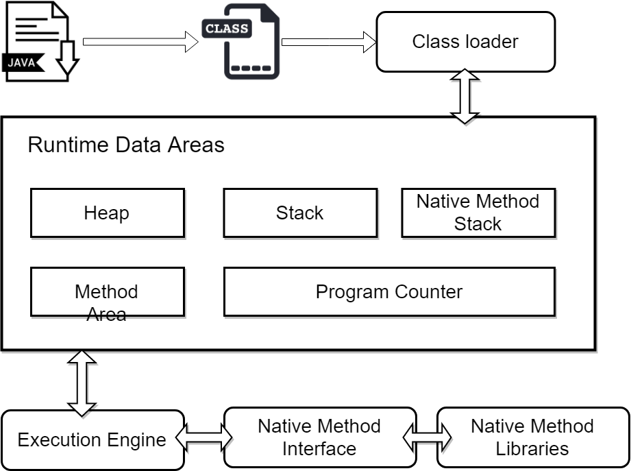
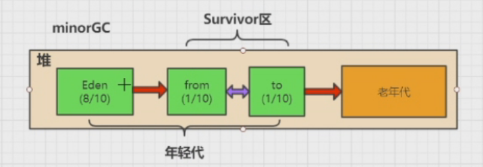
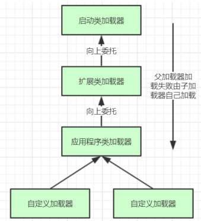
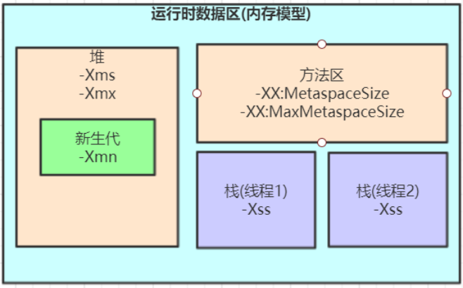

# JVM

> JVM（Java Virtual Machine）




JVM主要分为三个部分：

- 类加载子系统
- 运行时数据区域（内存结构）
- 执行引擎

## JVM內存结构

> 以下为SE6的Sun Hotspot内存结构；

.png)


> 查看字节码：javap [-v]  demo.class > demo.txt
>
> -v ：输出额外的信息

### 虚拟机栈

> 线程私有，即每有一个线程即在栈中分配一块内存；
>
> -Xss128k，默认为1M；设置每个线程的栈大小；

#### 栈帧

**栈帧(Stack Frame)是用于支持虚拟机进行方法调用和方法执行的数据结构栈帧存储了方法的局部变量表、操作数栈、动态连接和方法返回地址等信息。每一个方法从调用至执行完成的过程，都对应着一个栈帧在虚拟机栈里从入栈到出栈的过程。**

关于「栈帧」，《Java虚拟机规范》中的描述：

> 栈帧是用来存储数据和部分过程结果的数据结构，同时也用来处理动态连接、方法返回值和异常分派。
> 栈帧随着方法调用而创建，随着方法结束而销毁——无论方法正常完成还是异常完成都算作方法结束。
> 栈帧的存储空间由创建它的线程分配在Java虚拟机栈之中，每一个栈帧都有自己的本地变量表(局部变量表)、操作数栈和指向当前方法所属的类的运行时常量池的引用。

##### 局部变量表

**局部变量表(Local Variable Table)**是一组变量值存储空间，用于存放方法参数和方法内定义的局部变量。

局部变量表的容量以变量槽(Variable Slot)为最小单位，Java虚拟机规范并没有定义一个槽所应该占用内存空间的大小，但是规定了一个槽应该可以存放一个32位以内的数据类型。

32位虚拟机中一个Slot可以存放一个32位以内的数据类型（boolean、byte、char、short、int、float、reference和returnAddress八种）。reference类型表示对一个对象实例的引用。returnAddress类型是为jsr、jsr_w和ret指令服务的，目前已经很少使用了。

##### 操作数栈

**操作数栈(Operand Stack)**也常称为操作栈，它是一个后入先出栈(LIFO)。同局部变量表一样，操作数栈的最大深度也在编译的时候写入到方法的Code属性的max_stacks数据项中。

操作数栈的每一个元素可以是任意Java数据类型，32位的数据类型占一个栈容量，64位的数据类型占2个栈容量,且在方法执行的任意时刻，操作数栈的深度都不会超过max_stacks中设置的最大值。

当一个方法刚刚开始执行时，其操作数栈是空的，随着方法执行和字节码指令的执行，会从局部变量表或对象实例的字段中复制常量或变量写入到操作数栈，再随着计算的进行将栈中元素出栈到局部变量表或者返回给方法调用者，也就是出栈/入栈操作。一个完整的方法执行期间往往包含多个这样出栈/入栈的过程。

##### 动态链接

在一个class文件中，一个方法要调用其他方法，需要将这些方法的符号引用转化为其在内存地址中的直接引用，而符号引用存在于方法区中的运行时常量池。

Java虚拟机栈中，每个栈帧都包含一个指向运行时常量池中该栈所属方法的符号引用，持有这个引用的目的是为了支持方法调用过程中的**动态连接(Dynamic Linking)**。

这些符号引用一部分会在类加载阶段或者第一次使用时就直接转化为直接引用，这类转化称为**静态解析**。另一部分将在每次运行期间转化为直接引用，这类转化称为动态连接。

##### 方法出口

**当一个方法开始执行时，可能有两种方式退出该方法：**

- **正常完成出口**
- **异常完成出口**

**正常完成出口**是指方法正常完成并退出，没有抛出任何异常(包括Java虚拟机异常以及执行时通过throw语句显示抛出的异常)。如果当前方法正常完成，则根据当前方法返回的字节码指令，这时有可能会有返回值传递给方法调用者(调用它的方法)，或者无返回值。具体是否有返回值以及返回值的数据类型将根据该方法返回的字节码指令确定。

**异常完成出口**是指方法执行过程中遇到异常，并且这个异常在方法体内部没有得到处理，导致方法退出。

### 本地方法栈

- 线程私有

为C语言等所编写的native方法提供服务；

### 程序计数器

> 程序计数器是一块较小的内存空间，它的作用可以看作是当前线程所执行的字节码的行号指示器。在虚拟机的概念模型里字节码解释器工作时就是通过改变这个计数器的值来选取下一条需要执行的字节码指令，分支、循环、跳转、异常处理、线程恢复等基础功能都需要依赖这个计数器来完成。--《深入理解Java虚拟机》

- 线程私有
- 如果线程正在执行的是Java 方法，则这个计数器记录的是正在执行的虚拟机字节码指令地址
- 如果正在执行的是Native 方法，则这个技术器值为空（Undefined）
- **此内存区域是唯一一个在Java虚拟机规范中没有规定任何OutOfMemoryError情况的区域**

### 堆

- 线程共享
- 字符串常量池（在JDK1.7中的HotASpot中，已经把原本放在方法区的字符串常量池移到堆中）

> 官方文档说明： In JDK 7, interned strings are no longer allocated in the permanent generation of the Java heap, but are instead allocated in the main part of the Java heap (known as the young and old generations

对象存储区域、GC管理区域；

- 年轻代（1/3）
    - Eden（新生区）（8/10）
    - Survivor（存活区）
        - from（1/10）
        - to（1/10）

- 老年代（2/3）

Eden区内存占满后进行MinorGC，然后将存活的放入from区，form与to之间也为MinorGC；每一次GC会记录年龄；默认15次GC后放入到老年代；老年代满了后进行FullGC

### 方法区

「方法区」是 JVM 中规范的一部分，**线程共享**；

HotSpot虚拟机在「JDK8前」用「永久代」实现了「方法区」，在JDK8中，已经用「元空间」来替代了「永久代」作为「方法区」的实现；

「元空间」存储不在虚拟机中，而是使用本地内存，JVM 不会再出现方法区的内存溢出，以往「永久代」经常因为内存不够用导致跑出OOM异常；

#### 运行时常量池

已加载的类元信息、常量、静态变量、即时编译器编译后的代码；

类元信息包括类型信息、类型的常量池、字段信息、方法信息、指向类加载器的引用、指向Class实例的引用、方法表；

>   从「逻辑分区」的角度而言「常量池」是属于「方法区」的，但自从在「JDK7」以后，就已经把「运行时常量池」和「静态常量池」转移到了「堆」内存中进行存储（对于「物理分区」来说「运行时常量池」和「静态常量池』就属于堆）

## 编译到执行

Java源代码会被编译为class文件，class文件是运行在JVM之上的。

当我们日常开发安装JDK的时候，可以发现JDK是分「不同的操作系统」，JDK里是包含JVM的，所以Java依赖着JVM实现了『跨平台』；

JVM是面向操作系统的，它负责把Class字节码解释成系统所能识别的指令并执行，同时也负责程序运行时内存的管理。

**从源码文件(.java)到代码执行的过程**，简单来说分为4个步骤：

1.   java文件编译为class字节码文件
2.   class文件加载
3.   解释
4.   执行

### 1. 编译

编译过程会对源代码程序做 「语法分析」「语义分析」「注解处理」等等处理，最后才生成字节码文件。

比如对泛型的擦除和我们经常用的Lombok就是在编译阶段的注解处理中进行代码生成。

### 2. 类加载

#### 类加载机制

##### 加载（Loading）

-   **时机：**为了节省内存的开销，并不会一次性把所有的类都装载至JVM，而是等到「有需要」的时候才进行装载（比如new和反射等等）
-   class文件是通过「类加载器」装载到jvm中的，为了防止内存中出现多份同样的字节码，使用了双亲委派机制（它不会自己去尝试加载这个类，而是把请求委托给父加载器去完成，依次向上）
-   **规则：**JDK 中的本地方法类一般由根加载器（Bootstrp loader）装载，JDK 中内部实现的扩展类一般由扩展加载器（ExtClassLoader ）实现装载，而程序中的类文件则由系统加载器（AppClassLoader ）实现装载。

装载这个阶段它做的事情可以总结为：**查找并加载类的二进制数据，在JVM「堆」中创建一个java.lang.Class类的对象，并将类相关的信息存储在JVM「方法区」中**

##### 链接（Linking）

###### 验证

验证字节码文件的正确性，即是否符合 Java 规范和 JVM 规范；

###### 准备

给类的静态变量分配内存，并且赋予零值；

###### 解析

将符号引用替换为直接引用；

##### 初始化（Initialization）

对类的静态变量初始化为指定的值，执行静态代码块；

如果「实例化对象」则会调用方法对实例变量进行初始化，并执行对应的构造方法内的代码。

### 3. 解释

把字节码转换为操作系统识别的指令；

在解释阶段会有两种方式把字节码信息解释成机器指令码：

-   字节码解释器：非热点代码直接进行解释；
-   即时编译器(JIT)：对「热点代码」做编译；

#### 热点代码：

当JVM发现某个方法或代码块的运行特别频繁的时候，就有可能把这部分代码认定为「热点代码」；

使用「热点探测」来检测是否为热点代码。「热点探测」一般有两种方式，计数器和抽样。HotSpot使用的是「计数器」的方式进行探测，为每个方法准备了两类计数器：方法调用计数器和回边计数器

这两个计数器都有一个确定的阈值，当计数器超过阈值溢出了，就会触发JIT编译。

即时编译器把热点方法的指令码保存起来，下次执行的时候就无需重复的进行解释，直接执行缓存的机器语言

### 4. 执行

操作系统把解释器解析出来的指令码，调用系统的硬件执行最终的程序指令。

## 双亲委派机制

### 类加载器

- **启动类加载器**（Bootstrap ClassLoader）：负责加载支撑JVM运行的位于JRE的lib目录下的核心类库，比如
    rt.jar、charsets.jar等；C语言实现的；
- **扩展类加载器**（Extension ClassLoader）：负责加载支撑JVM运行的位于JRE的lib目录下的ext扩展目录中
    的JAR类包
- **应用程序类加载器**（Application ClassLoader）：负责加载ClassPath路径下的类包，主要就是加载你自己写
    的那些类
- **自定义加载器**：负责加载用户自定义路径下的类包



加载某个类时会先委托父加载器寻找目标类，找不到再委托上层父加载器加载，如果所有父加载器在自己的加载类路径下都找不到目标类，则在自己的类加载路径中查找并载入目标类。

**为什么要设计双亲委派机制？**
**沙箱安全机制**：自己写的java.lang.String.class类不会被加载，这样便可以防止
核心API库被随意篡改
**避免类的重复加载**：当父亲已经加载了该类时，就没有必要子ClassLoader再加
载一次，保证被加载类的唯一性

**打破双亲委派机制案例：**Tomcat

-   为了Web应用程序类之间隔离，为每个应用程序创建WebAppClassLoader类加载器
-   为了Web应用程序类之间共享，把ShareClassLoader作为WebAppClassLoader的父类加载器，如果WebAppClassLoader加载器找不到，则尝试用ShareClassLoader进行加载
-   为了Tomcat本身与Web应用程序类隔离，用CatalinaClassLoader类加载器进行隔离，CatalinaClassLoader加载Tomcat本身的类
-   为了Tomcat与Web应用程序类共享，用CommonClassLoader作为CatalinaClassLoader和ShareClassLoader的父类加载器
-   ShareClassLoader、CatalinaClassLoader、CommonClassLoader的目录可以在Tomcat的catalina.properties进行配置

## 垃圾回收机制

> Spring Boot程序的JVM参数设置格式(Tomcat启动直接加在bin目录下catalina.sh文件里)：
>  java ‐Xms2048M ‐Xmx2048M ‐Xmn1024M ‐Xss512K ‐XX:MetaspaceSize=256M ‐XX:MaxMetaspaceSize=256M ‐jar microservice‐eureka‐server.jar



### 引用计数法

给对象中添加一个引用计数器，每当有一个地方引用它，计数器就加1；当引用失效，计数器就减1；任何时候计数器为0的对象就是不可能再被使用的。这个方法实现简单，效率高，但是目前主流的虚拟机中并没有选择这个算法来管理内存，其最主要的原因是它很难解决对象之间相互循环引用的问题。 

### 可达性分析算法

这个算法的基本思想就是通过一系列的称为 “GC Roots” 的对象作为起点，
从这些节点开始向下搜索，找到的对象都标记为非垃圾对象，其余未标记的对象
都是垃圾对象
**GC Roots根节点**：线程栈的本地变量、静态变量、本地方法栈的变量等等

### 常见引用类型

java的引用类型一般分为四种：强引用、软引用、弱引用、虚引用

#### 强引用

普通的变量引用

```
public static User user = new User();
```

#### 软引用

将对象用SoftReference软引用类型的对象包裹，正常情况不会被回收，但是GC做完后发现释放不出空间存放新的对象，则会把这些软引用的对象回收掉。软引用可用来实现内存敏感的高速缓存。

```java
public static SoftReference user = new SoftReference(new User());
```

软引用在实际中有重要的应用，例如浏览器的后退按钮。按后退时，这个后退时显示的网页内容是重新进行请求还是从缓存中取出呢？这就要看具体的实现策略了。

- 如果一个网页在浏览结束时就进行内容的回收，则按后退查看前面浏览过的页面时，需要重新构建
- 如果将浏览过的网页存储到内存中会造成内存的大量浪费，甚至会造成内存溢出

#### 弱引用

将对象用WeakReference软引用类型的对象包裹，弱引用跟没引用差
不多，GC会直接回收掉，很少用

```java
public static WeakReference user = new WeakReference(new User());
```

#### 虚引用

虚引用也称为幽灵引用或者幻影引用，它是最弱的一种引用关系，几乎
不用

### finalize()方法最终判定对象是否存活

即使在可达性分析算法中不可达的对象，也并非是“非死不可”的，这时候它们
暂时处于“缓刑”阶段，要真正宣告一个对象死亡，至少要经历再次标记过程。
**标记的前提是对象在进行可达性分析后发现没有与GC Roots相连接的引用链。**

1. **第一次标记并进行一次筛选。**
筛选的条件是此对象是否有必要执行finalize()方法。
当对象没有覆盖finalize方法，对象将直接被回收。
2. **第二次标记**
如果这个对象覆盖了finalize方法，finalize方法是对象脱逃死亡命运的最后一次
机会，如果对象要在finalize()中成功拯救自己，只要重新与引用链上的任何的一
个对象建立关联即可，譬如把自己赋值给某个类变量或对象的成员变量，那在第
二次标记时它将移除出“即将回收”的集合。如果对象这时候还没逃脱，那基本
上它就真的被回收了。

### 如何判断一个类是无用的类

方法区主要回收的是无用的类，那么如何判断一个类是无用的类的呢？
类需要同时满足下面3个条件才能算是 “无用的类” ：

- 该类所有的实例都已经被回收，也就是 Java 堆中不存在该类的任何实例。
- 加载该类的 ClassLoader 已经被回收。
- 该类对应的 java.lang.Class 对象没有在任何地方被引用，无法在任何地方通过反射访问该类的方法。

## 垃圾回收算法

### 标记清除算法

算法分为“标记”和“清除”阶段：首先标记出所有需要回收的对象，在标记完成后统一回收所有被标记的对象。它是最基础的收集算法，效率也很高，但是会带来两个明显的问题：

1. 效率问题
2. 空间问题（标记清除后会产生大量不连续的碎片）

一般不使用该算法；

### 复制整理算法

为了解决效率问题，“复制”收集算法出现了。它可以将内存分为大小相同的两块，每次使用其中的一块。当这一块的内存使用完后，就将还存活的对象复制到另一块去，然后再把使用的空间一次清理掉。这样就使每次的内存回收都是对内存区间的一半进行回收。

效率较高，空间占用较大；

一般年轻代使用该算法；

### 标记整理算法

标记过程仍然与“标记-清除”算法一样，但后续步骤不是直接对可回收对象回收，而是让所有存活的对象向一段移
动，然后直接清理掉端边界以外的内存；

效率较低，空间占用小；

一般老年代使用该算法；

### 分代收集算法

当前虚拟机的垃圾收集都采用分代收集算法，这种算法没有什么新的思想，只是根据对象存活周期的不同将内存分为几块。一般将java堆分为新生代和老年代，这样我们就可以根据各个年代的特点选择合适的垃圾收集算法。

## 垃圾回收器

> 如果说收集算法是内存回收的方法论，那么垃圾收集器就是内存回收的具体实现。

### Serial

**单线程收集器**。它的`单线程`的意义不仅仅意味着它只会使用一条垃圾收集线程去完成垃圾收集工作，更重要的是它在进行垃圾收集工作的时候必须暂停其他所有的工作线程（ "Stop The World" ），直到它收集结束。

**新生代采用复制算法，老年代采用标记-整理算法。**

### ParNew

ParNew收集器其实就是Serial收集器的多线程版本。除了使用多线程进行垃圾收集外，其余行为（控制参数、收集算法、回收策略等等）和Serial收集器完全一样。默认的收集线程数跟cpu核数相同，当然也可以用参数(-XX:ParallelGCThreads)指定收集线程数，但是一般不推荐修改。
**新生代采用复制算法，老年代采用标记-整理算法。**

它是许多运行在Server模式下的虚拟机的首要选择，除了Serial收集器外，只有它能与CMS收集器（真正意义上的并发收集器，后面会介绍到）配合工作。

### Parallel Scavenge

> -XX:+UseParallelGC(年轻代),-XX:+UseParallelOldGC(老年代)

Parallel Scavenge 收集器类似于ParNew 收集器，是**Server 模式（内存大于2G，2个cpu）下的**
**默认收集器**，那么它有什么特别之处呢？
Parallel Scavenge收集器关注点是吞吐量（高效率的利用CPU）。CMS等垃圾收集器的关注点
更多的是用户线程的停顿时间（提高用户体验）。所谓吞吐量就是CPU中用于运行用户代码的时
间与CPU总消耗时间的比值。 Parallel Scavenge收集器提供了很多参数供用户找到最合适的停顿
时间或最大吞吐量，如果对于收集器运作不太了解的话，可以选择把内存管理优化交给虚拟机去完
成也是一个不错的选择。
**新生代采用复制算法，老年代采用标记-整理算法。**

### CMS

**CMS（Concurrent Mark Sweep）收集器是一种以获取最短回收停顿时间为目标的收集器。**它
非常符合在注重用户体验的应用上使用，**它是HotSpot虚拟机第一款真正意义上的并发收集器**，
它第一次实现了让垃圾收集线程与用户线程（基本上）同时工作。

#### 运行步骤

从名字中的`Mark Sweep`这两个词可以看出，CMS收集器是一种 “**标记-清除**”算法实现的，它
的运作过程相比于前面几种垃圾收集器来说更加复杂一些。整个过程分为四个步骤：

- **初始标记**： **暂停所有的其他线程**（STW），并记录下***gc roots***直接能引用的对象，**速度很快** ；
- **并发标记**： 同时开启GC和用户线程，用一个闭包结构去记录可达对象。但在这个阶段结束，这个闭包结构并不能保证包含当前所有的可达对象。因为用户线程可能会不断的更新引用域，所以GC线程无法保证可达性分析的实时性。所以这个算法里会跟踪记录这些发生引用更新的地方。**时间耗费长**
- **重新标记**： STW，重新标记阶段就是为了修正并发标记期间因为用户程序继续运行而导致标记产生变动的那一部分对象的标记记录，**这个阶段的停顿时间一般会比初始标记阶段的时间稍长，远远比并发标记阶段时间短**
- **并发清理**： 开启用户线程，同时GC线程开始对未标记的区域做清扫。

从它的名字就可以看出它是一款优秀的垃圾收集器，主要优点：**并发收集、低停顿**。

#### 缺点

- 对CPU资源敏感（会和服务抢资源）；
- 无法处理**浮动垃圾**(在并发清理阶段又产生垃圾，这种浮动垃圾只能等到下一次gc再清理
    了)；
- 它使用的回收算法-“**标记-清除**”算法会导致收集结束时会有大量空间碎片产生，当然通过参数-XX:+UseCMSCompactAtFullCollection 可以让jvm在执行完标记清除后再做整理
- 执行过程中的不确定性，会存在上一次垃圾回收还没执行完，然后垃圾回收又被触发的情况，**特别是在并发标记和并发清理阶段会出现**，一边回收，系统一边运行，也许没回收完就再次触发full gc，也就是"concurrent mode failure"，此时会进入stop the world，用serial old垃圾收集器来回收;

#### **CMS的相关参数**

1. *-XX:+UseConcMarkSweepGC*：启用cms
2. -*XX:ConcGCThreads*：并发的GC线程数
3. *-XX:+UseCMSCompactAtFullCollection*：FullGC之后做压缩整理（减少碎片）
4. *-XX:CMSFullGCsBeforeCompaction*：多少次FullGC之后压缩一次，默认是0，代表每次
FullGC后都会压缩一次
5. *-XX:CMSInitiatingOccupancyFraction*: 当老年代使用达到该比例时会触发FullGC（默认
是92，这是百分比）
6. *-XX:+UseCMSInitiatingOccupancyOnly*：只使用设定的回收阈值(-
XX:CMSInitiatingOccupancyFraction设定的值)，如果不指定，JVM仅在第一次使用设定
值，后续则会自动调整
7. *-XX:+CMSScavengeBeforeRemark*：在CMS GC前启动一次minor gc，目的在于减少
老年代对年轻代的引用，降低CMS GC的标记阶段时的开销，一般CMS的GC耗时 80%都在
remark阶段

### G1

**G1 (Garbage-First)是一款面向服务器的垃圾收集器,主要针对配备多颗处理器及大容量内存的机**
**器. 以极高概率满足GC停顿时间要求的同时,还具备高吞吐量性能特征.**

G1将Java堆划分为多个大小相等的独立区域（**Region**），JVM最多可以有2048个Region。
一般Region大小等于堆大小除以2048，比如堆大小为4096M，则Region大小为2M，当然也可以用参数"-XX:G1HeapRegionSize"手动指定Region大小，但是推荐默认的计算方式。

#### 内存划分

**G1保留了年轻代和老年代的概念，但不再是物理隔阂了**，它们都是（可以不连续）Region的集合。

**默认年轻代对堆内存的占比是5%**，如果堆大小为4096M，那么年轻代占据200MB左右的内存，对应大概是100个Region，可以通过“-XX:G1NewSizePercent”设置新生代初始占比，在系统运行中，JVM会不停的给年轻代增加更多的Region，但是最多新生代的占比不会超过60%，可以通过“-XX:G1MaxNewSizePercent”调整。年轻代中的Eden和Survivor对应的region也跟之前一样，**默认8:1:1**，假设年轻代现在有1000个region，eden区对应800个，s0对应100个，s1对应100个。

一个Region可能之前是年轻代，如果Region进行了垃圾回收，之后可能又会变成老年代，也就是说Region的区域功能可能会动态变化。

##### Humongous

G1垃圾收集器对于对象什么时候会转移到老年代跟之前讲过的原则一样，唯一不同的是对大对象的处理，G1有专门**分配大对象的Region叫Humongous区，而不是让大对象直接进入老年代的Region中。**在G1中，大对象的判定规则就是一个大对象**超过了一个Region大小的50%**，比如按照上面算的，每个Region是2M，只要一个大对象超过了1M，就会被放入Humongous中，而且一个**大对象如果太大，可能会横跨多个Region来存放。**

Humongous区专门存放短期巨型对象，不用直接进老年代，可以节约老年代的空间，避免因为老年代空间不够的GC开销。

Full GC的时候除了收集年轻代和老年代之外，也会将Humongous区一并回收。

#### 运行步骤

G1收集器一次GC的运作过程大致分为以下几个步骤：

- **初始标记**（initial mark，STW）：暂停所有的其他线程，并记录下gc roots直接能引用的对象，速度很快 ；

- **并发标记**（Concurrent Marking）：同CMS的并发标记

- **最终标记**（Remark，STW）：同CMS的重新标记

- **筛选回收**（Cleanup，STW）：筛选回收阶段首先对各个Region的**回收价值和成本进行排序，根据用户所期望的GC停顿时间**(可以用JVM参数 -XX:MaxGCPauseMillis指定)**来制定回收计划**；
  
    这个阶段其实也可以做到与用户程序一起并发执行，但是因为只回收一部分Region，时间是用户可控制的，而且停顿用户线程将大幅提高收集效率。**不管是年轻代或是老年代，回收算法主要用的是复制算法**，将一个region中的存活对象复制到另一个region中，这种不会像CMS那样回收完因为有很多内存碎片还需要整理一次，G1采用复制算法回收几乎不会有太多内存碎片。
    
    > 比如说老年代此时有1000个Region都满了，但是因为根据预期停顿时间，本次垃圾回收可能只能停顿200毫秒，那么通过之前回收成本计算得知，可能回收其中800个Region刚好需要200ms，那么就只会回收800个Region，尽量把GC导致的停顿时间控制在我们指定的范围内。
    
    

**G1收集器在后台维护了一个优先列表，每次根据允许的收集时间，优先选择回收价值最大的Region(**这也就是它的名字Garbage-First的由来)，比如一个Region花200ms能回收10M垃圾，另外一个Region花50ms能回收20M垃圾，在回收时间有限情况下，G1当然会优先选择后面这个Region回收。**这种使用Region划分内存空间以及有优先级的区域回收方式，保证了G1收集器在有限时间内可以尽可能高的收集效率。**

#### 特点

被视为JDK1.7以上版本Java虚拟机的一个重要进化特征。它具备以下特点：

- **并行与并发**：G1能充分利用CPU、多核环境下的硬件优势，使用多个CPU（CPU或者CPU核心）来缩短Stop-The-World停顿时间。部分其他收集器原本需要停顿Java线程来执行GC动作，G1收集器仍然可以通过并发的方式让java程序继续执行。
- **分代收集**：虽然G1可以不需要其他收集器配合就能独立管理整个GC堆，但是还是保留了分代的概念。
- **空间整合**：与CMS的“标记--清理”算法不同，G1从整体来看是基于“**标记整理**”算法实现的收集器；从局部上来看是基于“复制”算法实现的。
- **可预测的停顿**：这是G1相对于CMS的另一个大优势，降低停顿时间是G1 和 CMS 共同的关注点，但G1 除了追求低停顿外，还能建立可预测的停顿时间模型，能让使用者明确指定在一个长度为M毫秒的时间片段(通过参数"-XX:MaxGCPauseMillis"指定)内完成垃圾收集。

#### G1收集器参数设置

```txt
-XX:+UseG1GC:使用G1收集器
-XX:ParallelGCThreads:指定GC工作的线程数量
-XX:G1HeapRegionSize:指定分区大小(1MB~32MB，且必须是2的幂)，默认将整堆划分为2048个分区
-XX:MaxGCPauseMillis:目标暂停时间(默认200ms)
-XX:G1NewSizePercent:新生代内存初始空间(默认整堆5%)
-XX:G1MaxNewSizePercent:新生代内存最大空间
-XX:TargetSurvivorRatio:Survivor区的填充容量(默认50%)，Survivor区域里的一批对象(年龄1+年龄2+年龄n的多个年龄对象)总和超过了Survivor区域的50%，此时就会把年龄n(含)以上的对象都放入老年代
-XX:MaxTenuringThreshold:最大年龄阈值(默认15)
-XX:InitiatingHeapOccupancyPercent:老年代占用空间达到整堆内存阈值(默认45%)，则执行新生代和老年代的混合收集(MixedGC)，比如我们之前说的堆默认有2048个region，如果有接近1000个region都是老年代的region，则可能就要触发MixedGC了
-XX:G1HeapWastePercent(默认5%): gc过程中空出来的region是否充足阈值，在混合回收的时候，对Region回收都是基于复制算法进行的，都是把要回收的Region里的存活对象放入其他Region，然后这个Region中的垃圾对象全部清理掉，这样的话在回收过程就会不断空出来新的Region，一旦空闲出来的Region数量达到了堆内存的5%，此时就会立即停止混合回收，意味着本次混合回收就结束了。
-XX:G1MixedGCLiveThresholdPercent(默认85%) region中的存活对象低于这个值时才会回收该region，如果超过这个值，存活对象过多，回收的的意义不大。
-XX:G1MixedGCCountTarget:在一次回收过程中指定做几次筛选回收(默认8次)，在最后一个筛选回收阶段可以回收一会，然后暂停回收，恢复系统运行，一会再开始回收，这样可以让系统不至于单次停顿时间过长。
```

#### G1垃圾收集分类

##### YoungGC

YoungGC并不是说现有的*Eden*区放满了就会马上触发，而且G1会计算下现在Eden区回收大概要多久时间，如果**回收时间远远小于**参数 `-XX:MaxGCPauseMills` **设定的值，那么增加年轻代的region**，继续给新对象存放，不会马上做Young GC，直到下一次Eden区放满，**G1计算回收时间接近**参数 `-XX:MaxGCPauseMills` **设定的值，那么就会触发Young GC**

##### MixedGC

不是FullGC，老年代的堆占有率达到参数(`-XX:InitiatingHeapOccupancyPercen`)设定的值则触发，**回收所有的Young和部分Old(根据期望的GC停顿时间确定old区垃圾收集的优先顺序)以及大对象区**，正常情况G1的垃圾收集是先做MixedGC，主要使用**复制算法**，需要把各个region中存活的对象拷贝到别的region里去，拷贝过程中**如果发现没有足够的空region能够承载拷贝对象就会触发一次Full GC**

##### Full GC

**停止系统程序，然后采用单线程进行标记、清理和压缩整理**，好空闲出来一批Region来供下一次MixedGC使用，这个过程是**非常耗时**的。

#### G1垃圾收集器优化

假设参数 -XX:MaxGCPauseMills 设置的值很大，导致系统运行很久，年轻代可能都占用了堆内存的60%了，此时才触发年轻代gc。那么存活下来的对象可能就会很多，此时就会导致Survivor区域放不下那么多的对象，就会进
入老年代中。
或者是你年轻代gc过后，存活下来的对象过多，导致进入Survivor区域后触发了动态年龄判定规则，达到了Survivor区域的50%，也会快速导致一些对象进入老年代中。所以这里核心还是在于调节 -XX:MaxGCPauseMills 这个参数的值，在保证他的年轻代gc别太频繁的同时，还得考虑每次gc过后的存活对象有多少,避免存活对象太多快速进入老年代，频繁触发mixed gc.

# 参考

[JVM内存堆布局图解分析](https://www.cnblogs.com/SaraMoring/p/5713732.html)

[知乎 × Java虚拟机—栈帧、操作数栈和局部变量表](https://zhuanlan.zhihu.com/p/45354152)