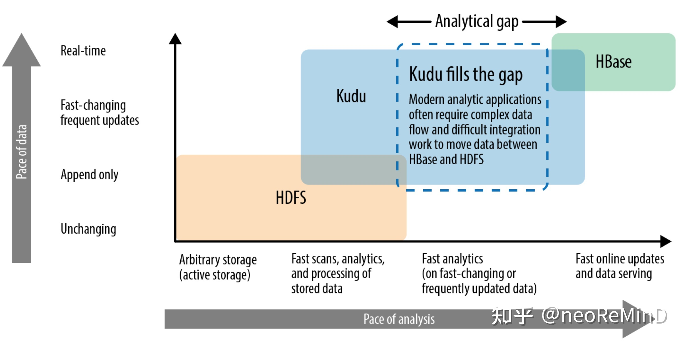
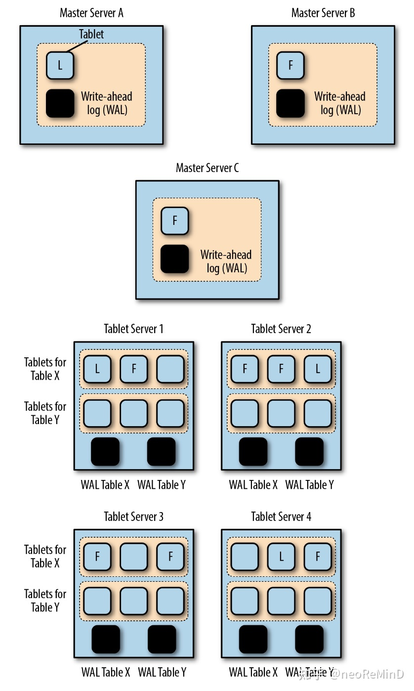
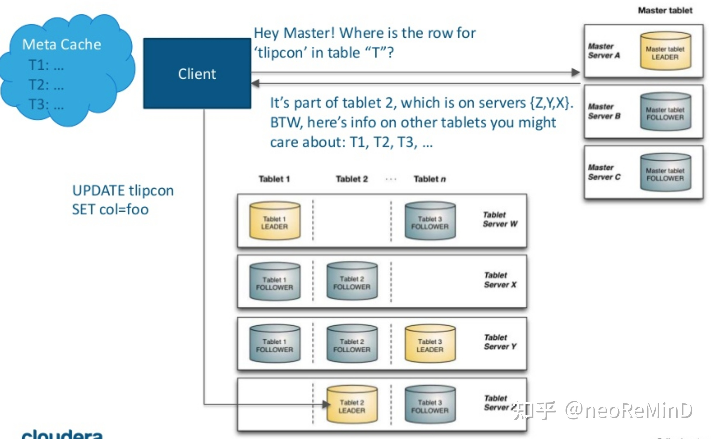
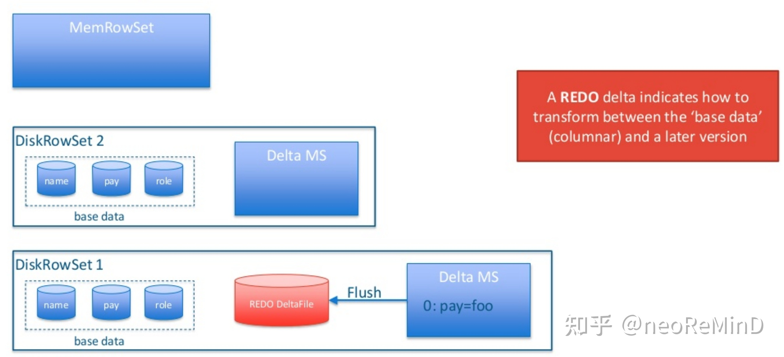
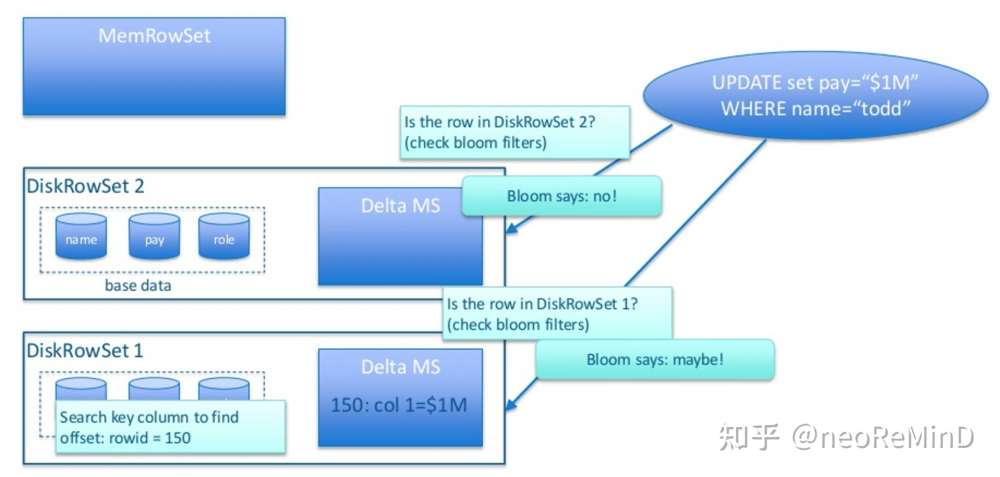

这篇论文是15年cloudera发表的论文，比较早，拿出来细读下，Kudu是一个OLAP存储引擎。

Kudu产出的原因，当时基于Hadoop的大数据存储引擎，例如Parquet、ORC都是immutable的，面向吞吐扫描的，不能支持实时更新和点查，而支持的产品又多是NoSQL，例如Hbase（列簇其实是伪列存）、C*，他们又不具备高吞吐的分析特性，而Kudu就在这二者中间求生存，提供“happy medium”的解决方案，既可以高吞吐扫描，又可以低延迟更新点查。

[图片来源](https://www.oreilly.com/library/view/getting-started-with/9781491980248/ch01.html)

## 架构

Kudu的表结构设计必须要有主键，每一行会被多encoded为一个二进制的“隐藏列”，做后续可能需要的主键检查使用，列类型和数据库data type映射起来类似，而不是hbase这种纯二进制化的存储。Kudu存储引擎提供sdk，支持insert、update、delete APIs，query API可以支持点查、range query以及predicates filter，projection pushdown。只支持单行事务，只提供SI隔离级别满足ACID。

Kudu的架构包含一个master server和若干tablet server。

[Getting Started with Kudu](https://www.oreilly.com/library/view/getting-started-with/9781491980248/ch04.html)

-   Master server

主要职责是1）metadata维护，包括catalog、表的tablet directory，2）集群协调，包括tablet server liveness拓扑感知和维护全局路由表。kudu的client是thick的，需要去Master server要metadata、catalog、tablet directory等缓存起来，这样可以bypass master server直连tablet server。

[图片来源](https://www.slideshare.net/cloudera/apache-kudu-technical-deep-dive)

-   tablet server

存储节点。Tablet server维护N个tablets（或者叫做shard，推荐10-100 tablets with 10G each per machine）。tablet可以按照hash、range partition，分布在tablet servers。由于tablet和tablet server不是绑定的，因此hash可以随意指定bucket number。分区的好处自然就是分治，便于写入和查询并行化（MPP）。tablet的副本和高可用由raft保证，更新会被raft log串行化，因此多个副本之间的一致性是可以保证的，另外kudu对raft还做了一些定制和优化。Tablet server论文中没提能否自动分裂合并。

## Tablet存储结构

存储统一叫做RowSets，内存中的叫做MemRowSets，持久化的叫做DiskRowSets，数据按照pk是有序的。

-   MemRowSet

相当于LSM-Tree的level0，行存的实时引擎，b-tree结构，实现上参考了masstree，吸收了基数树和B+树的优点，基数树的优点是时间复杂度只和数据长度有关，和数据量无关，但是基数树需要大量的空间，可能造成空间浪费，同时缓存命中率比较低，Masstree在每个节点使用了B+树来减少空间浪费和增加缓存命中率。Kudu非常重视实时引擎的性能，c++实现，有一些手段，包括每个叶子节点都是256byte，正好一个cacheline；实时引擎读吞吐提高，使用SIMD SSE2命令prefetch；LLVM JIT做列访问projection操作；b-tree上的每个record都是上面提到的隐藏列encoded pk，二进制直接memcmp会非常快。MemRowSet会异步的flush到磁盘成为DiskRowSet，flush的同时切出一个新的MemRowSet，老的MemRowSet成为RO的，用这种MVCC机制保证并发读写。

-   DiskRowSet

历史数据引擎，相当于LSM-Tree的level1，包括base data和delta data。

DiskRowSet Base data 32MB一个文件，文件内列存，一列被组成成若干page，page内和page间都是主键有序的，page内的数据有各种编码，比如string类型支持dict encoding，数值类型支持bitpack、bitshuffle，外面再套通用压缩算法比如lz4、gzip等。Page-level metadata，做b-tree的稀疏索引。kudu利用ordinal index的概念（类似lucene的docID，rowId），每个base data的行号从0递增，场景1：given ordinal index，可以seek到page，page内按行号seek即可；场景2：given pk，走b-tree index定位page，page内可以二分搜索找到数据。每个base data除了b-tree sparse index，还包含pk bloom filter，和rocksdb类似，不一定是page粒度，在内存中做LRU Cache缓存，针对写入操作做快速查重。

DiskRowSet delta data用于记录DiskRowSet历史数据的更新和删除，内存中的叫DeltaMemStore，flush到磁盘的叫DeltaFiles。Delta data仅在base data有更新、删除的时候才记录（注意，对于MemRowSet的更新、删除直接在masstree的mutation链表里面非in-place的做）。更新操作仅记录“逻辑日志”，类似mysql statemented binlog，而不是row based binlog，例如记录SET column id 3 = 'foo' 或者 DELETE。论文没有提及的，这种DeltaMemStore和DeltaFiles里存储的逻辑日志，可以看做了REDO log（如下图）。查询带timestamp，根据需要merge REDO log，同时compaction后也会保存之前版本的UNDO deltas，这样就可以实现snapshot isolation的读隔离级别。

-   写实现

每次写入需要查询MemRowSet和DiskRowSet是否已经存在主键，通过encoded pk bloom filter做剪枝，由于存在false positive，不确定就去DiskRowSet的pk列的B-tree index扫描，这是存在写放大的。论文没提及是否支持replace into。

-   读实现

借鉴MonetDB，向量化批量读，特别针对pk range query，可以快速做RowSet pruning。先查询MemRowSet，再查询DiskRowSet，由于DiskRowSet的pk可能overlap，因此可能需要访问多个文件，因此存在读放大。DiskRowSet内走主键定位行号，根据projection，通过行号反查projection列中的值，再查询Delta data，apply逻辑REDO log到数据，最后返回。

## Compaction

-   DiskRowSet合并

所有的DiskRowSet都在LSM-Tree的level1，包含了min-max pk这种zone map，这样形成很多interval，在compaction时候通过merge interval算法选择合并哪些DiskRowSet，每个DiskRowSet保持32MB，期间做标记->物理删除，通过减少overlap的DiskRowSet，优化查询。

-   Delta compaction

delta data flush磁盘后形成多个delta files，delta data多了影响查询性能，因此需要合并，调度策略参考delta row count / base row count决定是否做。有一些优化，如果delta只更新少数列，则其他不变列不用重新编码压缩，整块append即可。

-   调度策略

由于compaction消耗cpu、内存、io，因此需要有策略的调度，最小化影响。挑选合并DiskRowSet的做法是，根据DiskRowSet消耗的磁盘io大小（例如128MB的带宽），结合DiskRowSet的overlap影响查询效率的程度，做一个knapsack 01背包算法，也就是给定一个背包大小（磁盘IO），找出价值最大的文件做合并（合并后查询效率会最大化提升）。workload可以自适应，写入多的时候flush多，写入少的时候文件做合并。

## 总结

kudu在2015年能够提出一种折中高吞吐和低延迟更新点查的存储引擎，结合上层的imapla或者spark计算引擎，是一个非常不错的工程。kudu的实时性基于LSM-Tree模型，更新操作强依赖主键，数据有序性保证了随机访问特性，而列存也支持了高吞吐扫，集群管理分治raft多副本，这个架构和TiDB有类似之处，只不过TiDB单机存储引擎用rocksdb，而不是kudu这种列存rowset。列存在查询时候相比行存，需要多seek很多次，读放大是不小的，kudu是基于类似行号（row id）来找projection列的。查询链路，需要merge逻辑日志，同样存在读放大，因此需要compaction。compaction会保留REDO/UNDO log来支持MVCC SI隔离级别读。compaction调度策略上有一些创新，比如基于01背包算法来做合并rowset选择，自适应的根据workload来触发调度等。

## 文章来源

[知乎 neoReMinD × Paper read：Kudu - Storage for Fast Analytics on Fast Data](https://zhuanlan.zhihu.com/p/374369354)