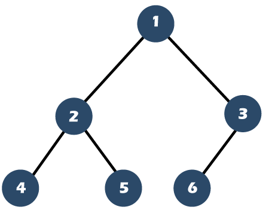
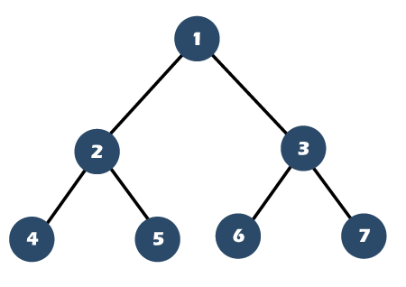
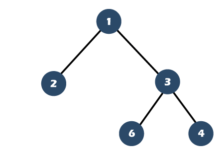
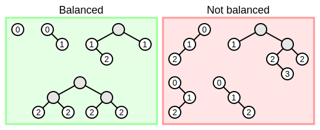
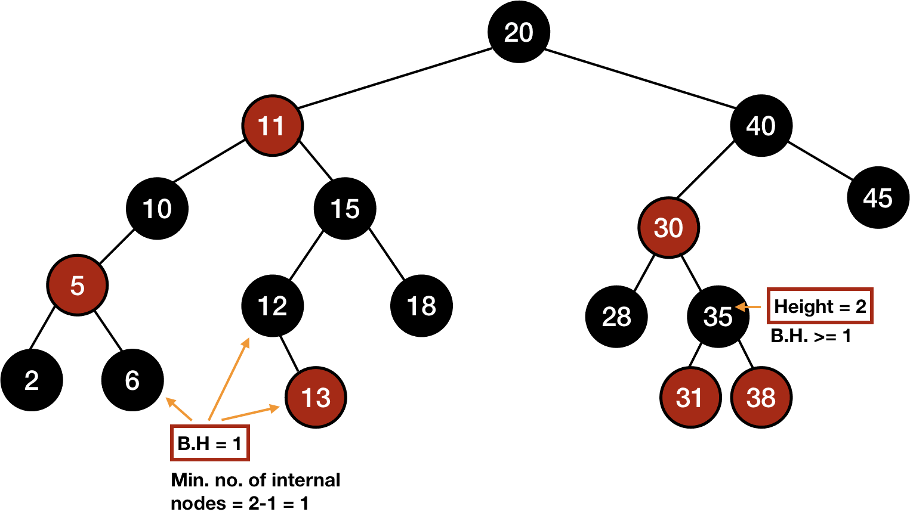
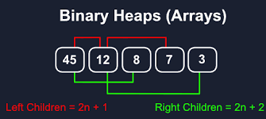

# 二叉树

## 种类

### 完全二叉树(Complete Binary Tree)

> 堆总是一棵完全二叉树。

```
若设二叉树的深度为h，除第 h 层外，其它各层 (1～h-1) 的结点数都达到最大个数，第 h 层所有的结点都连续集中在最左边，这就是完全二叉树。
```



### 完美二叉树(Perfect Binary Tree)

一个二叉树，如果每一个层的结点数都达到最大值，则这个二叉树就是满二叉树。



### 满二叉树(Full Binary Tree)

> 国内一般使用满二叉树指代**完美二叉树**

满二叉树的结点要么是叶子结点，度为0，要么是度为2的结点，不存在度为1的结点。



### 二叉查找树(Binary Search Tree)

> 又称二叉搜索树

二叉查找树是有数值的，**二叉查找树是一个有序树**。

- 若它的左子树不空，则左子树上所有结点的值均小于它的根结点的值；
- 若它的右子树不空，则右子树上所有结点的值均大于它的根结点的值；
- 它的左、右子树也分别为二叉查找树

### 平衡二叉树(Balanced Binary Tree)

> 为改进的[二叉查找树](https://zh.wikipedia.org/wiki/二叉查找树)，又被称为AVL（Adelson-Velsky and Landis）树

它是一棵空树或它的左右两个子树的高度差的绝对值不超过1，并且左右两个子树都是一棵平衡二叉树。



### 红黑树(Red–Black Tree)

> 红黑树是一种特化的AVL树（平衡二叉树），都是在进行插入和删除操作时通过特定操作保持二叉查找树的平衡，从而获得较高的查找性能。

- 节点是红色或黑色。
- 根是黑色。
- 所有叶子都是黑色（叶子是NIL节点）。
- 每个红色节点必须有两个黑色的子节点。（从每个叶子到根的所有路径上不能有两个连续的红色节点。）
- 从任一节点到其每个叶子的所有简单路径都包含相同数目的黑色节点。



## 存储方式

- 链式存储：左右指针
- 顺序存储：数组

  > **如果父节点的数组下标是 `i`，那么它的左孩子就是 `i * 2 + 1`，右孩子就是 `i * 2 + 2`**
  >



## 遍历方式

1. 深度优先遍历：**DFS（Deep First Search）**

   先往深走，遇到叶子节点再往回走；

   `递归法` `迭代法（栈）` 
   
   - 前序遍历：中左右：1 2 4 5 3 6 7
   - 中序遍历：左中右：4 2 5 1 6 3 7
   - 后序遍历：左右中：4 5 2 6 7 3 1
   
   **即中间节点的读取顺序**；


2. 广度优先遍历：**BFS（Breadth First Search）**

   `迭代法（队列）`  一层一层的去遍历；

   - 层次遍历：**使用数组存储二叉树时的顺序**
